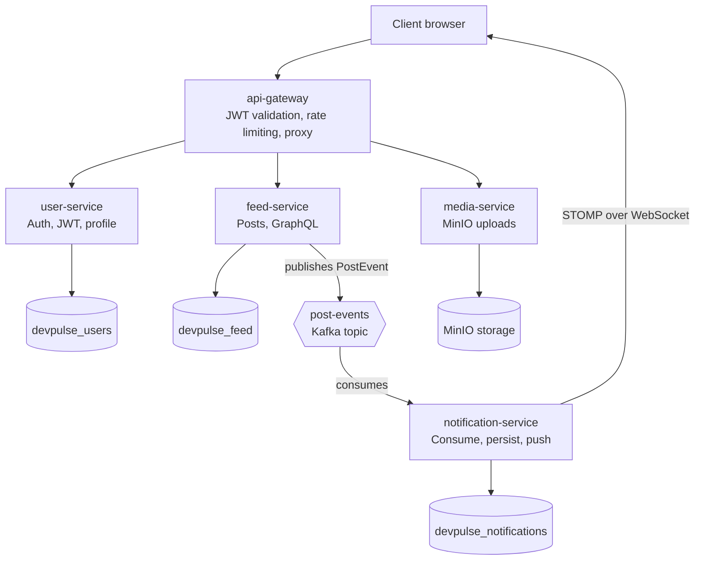

# DevPulse

A real-time developer activity platform built as a microservices system, where developers can post updates, browse a feed, and (soon) react, comment, and receive live notifications.

This project is being built in phases as a hands-on exploration of microservice architecture, GraphQL, event-driven design (Kafka), and real-time delivery (WebSockets), with a focus on the small design decisions that affect scalability and performance.

## Architecture



**Design principles:**
- Each service owns its own database (schema-per-service) — no shared tables across services.
- The gateway is a pure proxy: it validates JWTs and rate-limits once at the edge, then forwards a trusted `X-User-Id` header downstream. No other service re-validates JWTs.
- Each service owns its own GraphQL schema; the gateway does not aggregate or expose GraphQL itself.
- Cross-service communication for events (e.g. new posts triggering notifications) goes through Kafka, not synchronous service-to-service calls.

## Tech stack

- **Language / framework:** Java, Spring Boot 3.5.x, Spring Cloud Gateway (webmvc)
- **API:** GraphQL (Spring for GraphQL)
- **Database:** PostgreSQL 18, one schema per service, Flyway migrations
- **Caching / rate limiting:** Redis (Lettuce), Bucket4j
- **Messaging:** Apache Kafka
- **Object storage:** MinIO
- **Auth:** JWT (jjwt), Spring Security
- **Local infra:** Docker Compose

## Services

| Service | Port | Responsibility |
|---|---|---|
| `api-gateway` | 8080 | JWT validation, rate limiting, routing to downstream services |
| `user-service` | 8081 | Registration, login, JWT issuance, refresh tokens, profile |
| `feed-service` | 8082 | Posts, cursor-paginated feed, GraphQL subscriptions, Kafka producer |
| `notification-service` | 8083 | Kafka consumer, persists and pushes notifications over STOMP/WebSocket |
| `media-service` | 8084 | Server-side image upload (compress/resize, then store) for post images and profile pictures via MinIO |

## Load testing

The async pipeline (HTTP → Kafka → Redis pub/sub → WebSocket) is load-tested end-to-end with k6, including a multi-instance Redis fanout check and gateway rate-limit validation. See [`load-tests/README.md`](./load-tests/README.md) for results, methodology, and known limitations.

## Progress

- [x] **Phase 1** — Project scaffolding: Spring Boot, PostgreSQL, Flyway, Docker Compose, GraphQL, Kafka, and initial architecture design across all services.
- [x] **Phase 2** — `user-service`: registration, JWT (access + refresh tokens in Redis), login, logout, profile queries/mutations.
- [x] **Phase 3** — `api-gateway`: JWT validation filter, Redis-backed rate limiting (Bucket4j), request routing, identity header propagation to downstream services.
- [x] **Phase 4** — `feed-service`: post creation/deletion, cursor-based (keyset) pagination, Relay-style GraphQL connections, GraphQL subscriptions over `graphql-ws`, Kafka producer emitting post events.
- [x] **Phase 5** — `notification-service`: Kafka consumer for post events, persisted notifications, real-time delivery over STOMP/WebSocket, Redis pub/sub for cross-instance fanout.
- [x] **Phase 5.1** — Reactions: `feed-service` reaction mutation (create/update) publishing to a `reaction-events` Kafka topic, consumed by `notification-service` and delivered through the same WebSocket pipeline as post notifications.
- [ ] **Phase 6** — `media-service`: server-side image upload for post images and profile pictures. Client sends a multipart file directly to `media-service` (no presigned MinIO URLs), which validates the real file type (Apache Tika, not the client-supplied `Content-Type`), compresses/resizes it, stores it in MinIO, and returns a URL — which the client then passes into the existing `createPost`/`updateProfile` mutations. Exposed as a plain REST multipart endpoint rather than GraphQL, since GraphQL's multipart upload spec adds more setup than it's worth here. No Kafka event on upload — this flow needs no cross-service messaging.

### Key design decisions (Phase 4)

**Cursor-based pagination over offset pagination.** Offset pagination becomes inefficient as the dataset grows — the database still has to scan and discard every skipped row, and results can shift if new rows are inserted mid-scroll. Feed pagination instead uses a composite index on `(created_at DESC, id DESC)`, where each page's cursor is the last row seen rather than a row count. This gives stable ordering under concurrent writes and maps directly onto Relay-style GraphQL connections (`edges` / `pageInfo`).

**UUIDv7 over UUIDv4 for primary keys.** Random UUIDs (v4) fragment the B-tree index over time, since every insert lands in a random position. UUIDv7 embeds a timestamp prefix, so IDs are naturally sortable and inserts stay roughly sequential — combining the collision-resistance of a UUID with the index locality of an auto-increment key.

### Key design decisions (Phase 5)

**Redis pub/sub for cross-instance WebSocket delivery.** A user's WebSocket connection is only held by one `notification-service` instance at a time, so a naive setup would miss users connected to a different instance than the one that consumed the Kafka event. Publishing each notification to a Redis channel lets every instance subscribe and forward to its own locally-connected clients, decoupling "which instance received the Kafka message" from "which instance holds the user's socket."

## Local development setup

**Prerequisites:** Docker, JDK 25, IntelliJ IDEA (or any IDE with Maven support)

1. Start infrastructure (PostgreSQL, Redis, Kafka, MinIO):
   ```bash
   docker compose up -d
   ```
2. Run each service from IntelliJ run configurations (or `mvn spring-boot:run` per module).
3. Notes on local config:
    - PostgreSQL should be addressed as `127.0.0.1:5432`, not `localhost`, to avoid a Windows IPv6 resolution issue.
    - Redis runs on `127.0.0.1:6379`.
    - Each service runs its own Flyway migrations on startup against its own database.

## Testing GraphQL directly

Each service exposes its own GraphiQL UI for local testing, independent of the gateway:

- `user-service`: `http://localhost:8081/graphiql`
- `feed-service`: `http://localhost:8082/graphiql`

When testing a service directly (bypassing the gateway), you can manually set the `X-User-Id` header in GraphiQL's headers panel to simulate an authenticated request, since the gateway is normally what stamps this header after validating a JWT.

To test the full authenticated flow through the gateway, obtain a JWT via `user-service`'s `login` mutation, then send it as `Authorization: Bearer <token>` to `http://localhost:8080/<service>/graphql` — no `X-User-Id` header needed, since the gateway derives and attaches it from the token.
