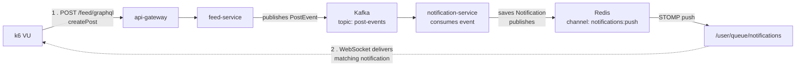

# DevPulse Load Tests

k6 load tests for DevPulse's async event pipeline, measuring end-to-end latency (HTTP → Kafka → Redis pub/sub → WebSocket delivery), not just HTTP response time.

## What's tested

- **End-to-end post-creation latency** — HTTP request through Kafka, Redis pub/sub, and WebSocket delivery, correlated via the post's UUIDv7 ID
- **Latency under increasing concurrency** (10 → 75 VUs)
- **Multi-instance Redis pub/sub fanout** — notification published by one `notification-service` instance, delivered to a client on a different instance
- **API gateway rate limiting** — Bucket4j + Redis distributed limiter, per-user keyed

## Pipeline under test


## Quick Start

1. Install k6:
   ```bash
   winget install k6.k6
   ```

2. Bring up the stack:
   ```bash
   docker-compose up -d --build
   docker-compose ps
   ```

3. Run the post-creation pipeline test at a given concurrency:
   ```bash
   cd load-tests
   k6 run -e VUS=10 00_post_pipeline.js
   ```

4. Run the full concurrency ramp:
   ```bash
   k6 run -e VUS=10 00_post_pipeline.js
   k6 run -e VUS=25 00_post_pipeline.js
   k6 run -e VUS=50 00_post_pipeline.js
   k6 run -e VUS=75 00_post_pipeline.js
   ```

5. Run the rate-limit test (needs a valid access token):
   ```bash
   k6 run -e TOKEN=<accessToken> 04_rate_limit.js
   ```

## Results

End-to-end latency (`e2e_post_latency_ms`), HTTP request → WebSocket delivery, 12-core / 7.6GB RAM local Docker Compose stack:

| Concurrent VUs | Min | Median (p50) | Avg | p90 | p95 | Max | Iterations | Checks passed |
|---|---|---|---|---|---|---|---|---|
| 10 | 38ms | 107.5ms | 119ms | 172.5ms | 262.5ms | 307ms | 70 | 280/280 (100%) |
| 25 | 53ms | 274.5ms | 348.6ms | 657ms | 760ms | 851ms | 100 | 400/400 (100%) |
| 50 | 51ms | 331.5ms | 305.5ms | 468.1ms | 493.1ms | 559ms | 150 | 600/600 (100%) |
| 75 | 98ms | 461ms | 447.8ms | 659.7ms | 682.4ms | 747ms | 250 | 1000/1000 (100%) |

Zero failed requests across 2,280 checks at every concurrency level tested.

**Bottleneck found and fixed:** `notification-service`'s Kafka listener defaulted to `concurrency = 1` despite `post-events` having 3 partitions, serializing message processing under load. Fixed via `.setConcurrency(3)`.

**Multi-instance fanout:** confirmed — two `notification-service` instances sharing the same Redis/Postgres/Kafka correctly deliver a notification published by one instance to a WebSocket client connected to the other.

## Known limitations

- **p95 is noisier than median** at lower iteration counts (50–100 samples), partly due to a startup burst at the beginning of every `shared-iterations` scenario — not isolated from the reported percentiles in this data.
- **The concurrency ramp test doesn't exercise the gateway's rate limiter, by design.** All requests go through `api-gateway` (`localhost:8080`). The rate limiter is keyed per-authenticated-user (`X-User-Id`, verified from the JWT), and each ramp-test iteration uses a fresh synthetic user making one request — so no user approaches their own limit. Rate-limit behavior is validated separately by `04_rate_limit.js`, which reuses one token across many rapid requests.
- **WebSocket identity is a client-supplied, unverified query param** (`?userId=<email>`), not JWT-validated at handshake — a gap in the app itself, not the test.
